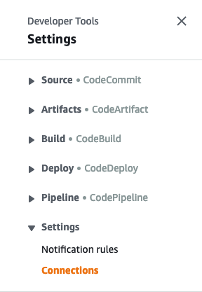
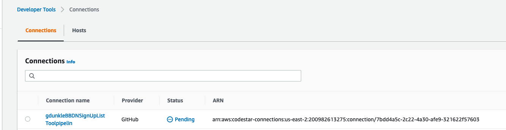
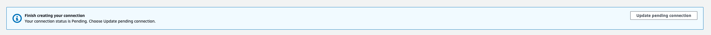
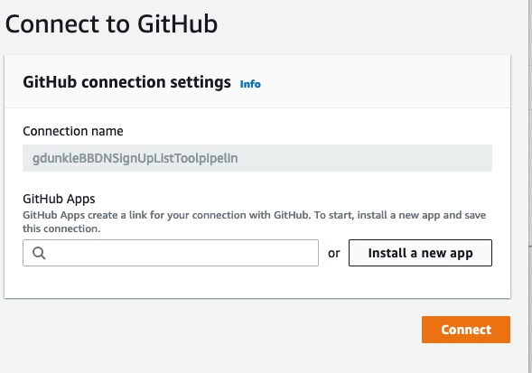
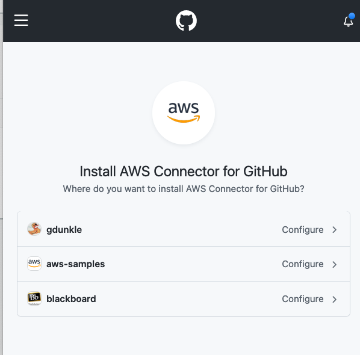
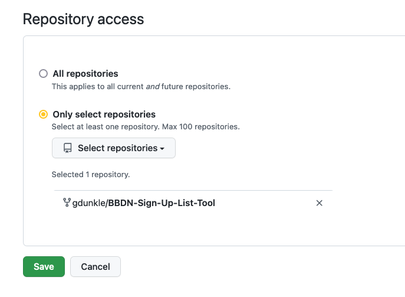
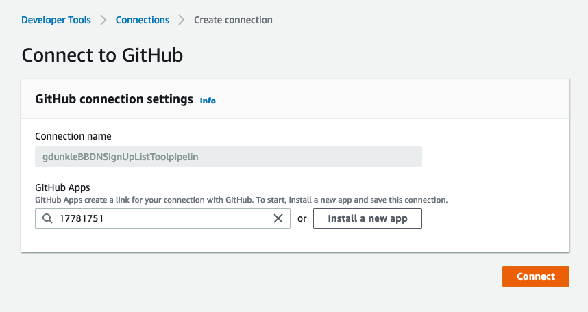

# LTI Example Tool

This is an LTI tool allow an instructor to create an assessment, and allow students to complete the assessment and get a grade

#### Prerequisites

- [AWS Command Line Interface](https://aws.amazon.com/cli/)
- [AWS CDK](https://docs.aws.amazon.com/cdk/latest/guide/getting_started.html#getting_started_install)
- Python 3.9 or later
- [Poetry](https://python-poetry.org/docs/) - More info on working with Poetry can be found [here](./docs/POETRY.md)

To create a virtualenv on MacOS and Linux:

```
$ poetry install
```

Drop into the python virtual env

```
$ poetry shell
```

## Deployment

If you haven't already be sure to bootstrap your cdk environment. This only needs to be done once.

```
$ cdk bootstrap 
```

At this point you can now deploy the stacks to your AWS account

### workshop-application-stack
This stack deploys the LTI application directly to you AWS account.
```
$ cdk deploy 
```

At this point you can now deploy the stacks to you AWS account

### pipeline-stack (optional)
This stack sets up a CI/CD pipeline connected to a GitHub repository which will build and deploy the LTI application when new code is checked in.

To deploy the pipeline issue the following command

```
$ cdk deploy -c account=$AWS_DEFAULT_ACCOUNT -c region=$AWS_DEFAULT_REGION -c repo=<THE_GITHUB_ORG>/<THE_GIT_HUB_REPOSITORY> -c branch=$(git rev-parse --abbrev-ref HEAD) -c codestar_connection_arn=<CODESTART_CONNECTION_ARN> pipeline-stack-$(git rev-parse --abbrev-ref HEAD | sed -e 's/\//-/g')
```

To complete the pipeline setup you must go into the AWS Console, navigate to CodePipeline, on the left hand side expand "Settings" and click "Connections"



Look for a connection with your repo name and a status of "Pending", click on this connection



Click the button that says Update pending connection



Click "Install a new app"



Select the correct organization



Ensure the right repository is selected, hit save (you may have to toggle the radio buttons to get the save button to activate)



Finally, click "Connect" to complete the connection setup



Once the connection to github is complete you can trigger the pipeline by checking code into the configured branch or manually triggering the pipeline by clicking the "Release change" button in the AWS Console

You should deploy the pipeline stack first before

### Run locally with Flask
You can also run locally using the following command

```
$ flask run
```

To update things if a dependency has changed run

```
poetry update
```

### Configuration

If you want to run locally via `flask run` you'll need to set some environment variables. It's best to create a `.env` (or `.envrc` if using direnv) file.
These are the possible values you can change:

````
export AWS_PROFILE=879999_Developer
export AWS_DEFAULT_ACCOUNT=879999
export AWS_DEFAULT_REGION=us-east-1
export AWS_REGION=us-east-1
export TABLE_NAME=your_table_name
export LOCAL=true
export PORT=5000
export DOMAIN=127.0.0.1
export KMS_KEY_ID='arn:aws:kms:???'
export KMS_SYMMETRIC_KEY_ID='arn:aws:kms:???'

# The next three are stored in ParameterStore. Create keys for your instance
export LTI_TOOLING_API_URL_KEY='/keys/somewhere/tool_url'
export LEARN_APPLICATION_KEY_KEY='/keys/somewhere/learn_key'
export LEARN_APPLICATION_SECRET_KEY='/keys/somewhere/learn_secret'```

### MKDocs

We suggest the use of [Mkdocs](https://www.mkdocs.org/getting-started/) for documentation.

#### Install

````

pip install mkdocs

```

#### Serve

```

mkdocs serve

```

#### Pre-commit hooks

This project has a set of hooks for [pre-commit](https://pre-commit.com/) for formatting.

To install this hooks into your repo, run.

```

pre-commit install

```

```
