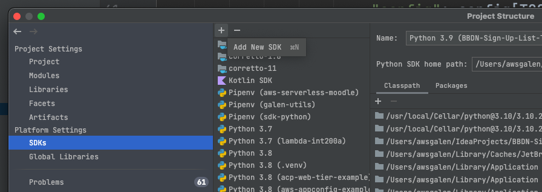
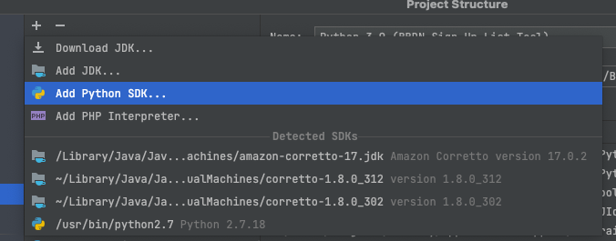
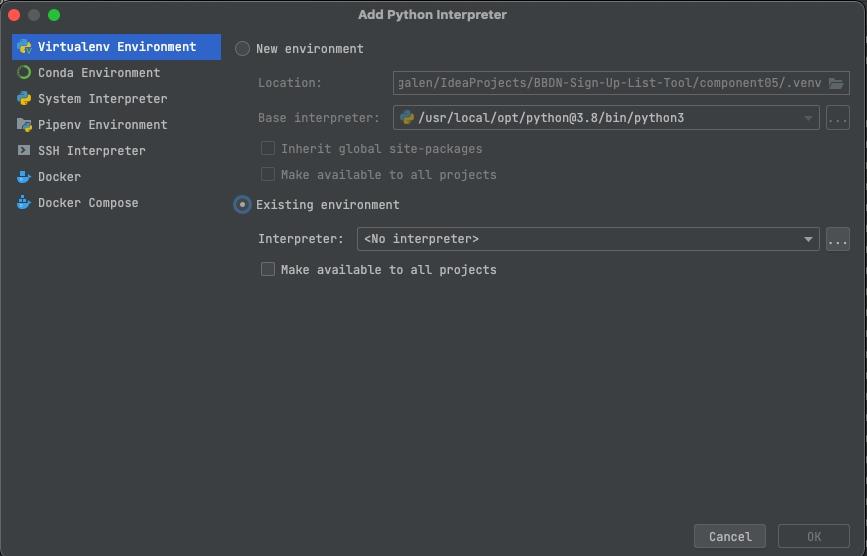
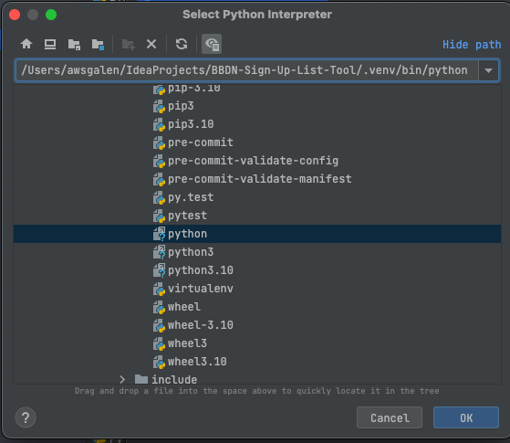
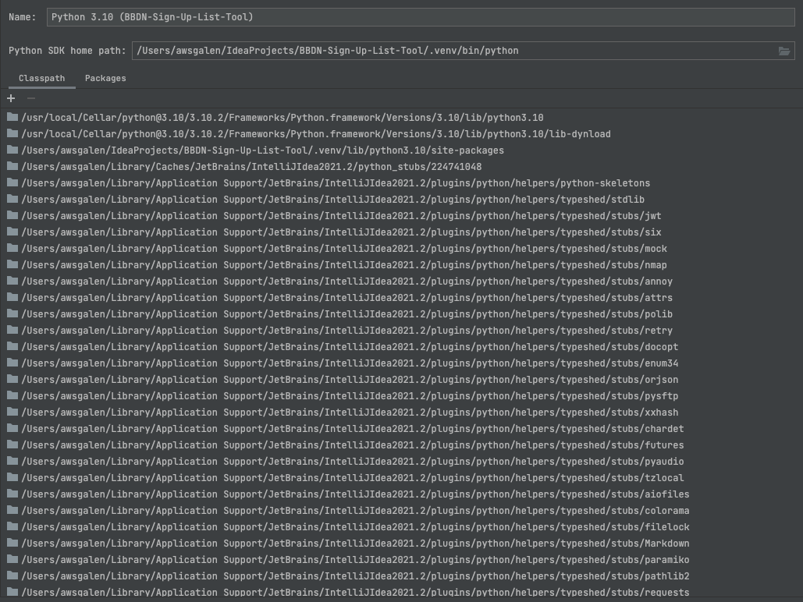
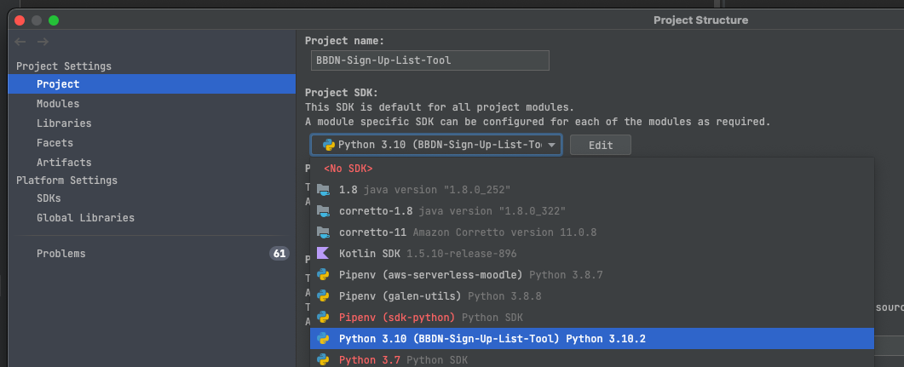

# Python Poetry

Poetry is a tool for dependency management and packaging in Python. It allows you to declare the libraries your project depends on and it will manage (install/update) them for you.

Documentation can be found [here](https://python-poetry.org/docs/)

Poetry uses the [pyproject.toml](https://python-poetry.org/docs/pyproject/) file to declare dependencies instead of requirements.txt

# Why Poetry

The main reason this project chose Poetry as the Python package manager was because of its use of toml as the format for the lock file. Toml is easy to parse which makes it east to generate a Lambda layer for all the dependencies.

Many others in the Python community are finding Poetry to be a better solution over straight pip, pipenv, conda, etc;

- [Stop using Pip, use Poetry Instead!](https://nanthony007.medium.com/stop-using-pip-use-poetry-instead-db7164f4fc72)
- [Why Is Poetry Essential to the Modern Python Stack?](https://andrewbrookins.com/python/why-poetry/)
- [Poetry: finally an all-in-one tool to manage python packages](https://medium.com/analytics-vidhya/poetry-finally-an-all-in-one-tool-to-manage-python-packages-3c4d2538e828)

## Using poetry with Intellij

To use Poetry's virtual environment in Intellij first follow the [prerequisites](../README.md#Prerequisites) in the [README.md](../README.md) file

Then open the "Project Structure" in Intellij and select "SDKs" then click the "+" button to "Add New SDK"

Select "Add Python SDK..."

Select "Virtualenv Environment", select "Existing environment", and then click "..." next to "Interpreter"

Enter the path to your project's .venv/bin/python file and hit "OK"

The classpath will be populated. Give the SDK a unique name to identify it as the SDK for this project.

Finally, ensure your project has the newly created SDK selected under "Project Structure" -> "Project Settings" -> "Project" -> "Project SDK"

